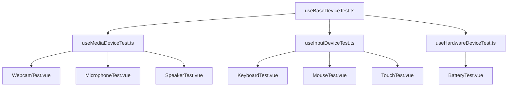

# Unified Composable Architecture - Phase 1 Implementation

## Overview

This document describes the new unified composable architecture implemented as part of Phase 1 optimization. The architecture replaces the previous dual-system (`useDeviceTest.js` and `useEnhancedDeviceTest.js`) with a single, extensible base composable and specialized extensions.

## Architecture Design



## Base Composable: `useBaseDeviceTest`

### Location
`src/composables/base/useBaseDeviceTest.ts`

### Features
- **Core functionality**: Device enumeration, permission management, error handling
- **TypeScript support**: Full type definitions and interfaces
- **Extensible design**: Built for extension with specialized composables
- **Lifecycle management**: Automatic initialization and cleanup
- **State management**: Comprehensive state tracking and computed properties

### Usage
```typescript
import { useBaseDeviceTest } from '../composables/base/useBaseDeviceTest';

const deviceTest = useBaseDeviceTest({
  deviceKind: 'videoinput',
  deviceType: 'Camera',
  permissionType: 'camera',
  testName: 'webcam',
  autoInitialize: true
}, emit);
```

## Extension Composables

### Media Device Extension: `useMediaDeviceTest`
**Location**: `src/composables/extensions/useMediaDeviceTest.ts`

**Features**:
- Enhanced media device handling (camera, microphone, speakers)
- Device detection delay for better UX
- Stream management and permission handling
- Media-specific error handling

**Usage**:
```typescript
import { useMediaDeviceTest } from '../composables/extensions/useMediaDeviceTest';

const mediaTest = useMediaDeviceTest({
  deviceKind: 'videoinput',
  deviceType: 'Camera',
  permissionType: 'camera',
  testName: 'webcam',
  enableDeviceDetectionDelay: true,
  detectionDelayMs: 2000
}, emit);
```

### Input Device Extension: `useInputDeviceTest`
**Location**: `src/composables/extensions/useInputDeviceTest.ts`

**Features**:
- Input event tracking (keyboard, mouse, touch)
- Event history and summarization
- Visual feedback and animations
- Input-specific testing patterns

**Usage**:
```typescript
import { useInputDeviceTest } from '../composables/extensions/useInputDeviceTest';

const inputTest = useInputDeviceTest({
  testName: 'keyboard',
  enableEventTracking: true,
  enableVisualFeedback: true,
  maxEventHistory: 100
}, emit);
```

## Migration Guide

### From `useEnhancedDeviceTest` to `useMediaDeviceTest`

**Before**:
```javascript
import { useEnhancedDeviceTest } from '../composables/useEnhancedDeviceTest.js';

const deviceTest = useEnhancedDeviceTest(
  {
    deviceKind: 'videoinput',
    deviceType: 'Camera',
    permissionType: 'camera',
    testName: 'webcam',
  },
  emit
);
```

**After**:
```typescript
import { useMediaDeviceTest } from '../composables/extensions/useMediaDeviceTest.ts';

const mediaTest = useMediaDeviceTest({
  deviceKind: 'videoinput',
  deviceType: 'Camera',
  permissionType: 'camera',
  testName: 'webcam',
  enableDeviceDetectionDelay: true,
  detectionDelayMs: 2000
}, emit);
```

### Key Changes
1. **Import path**: Update to new extension location
2. **Options object**: Use object syntax instead of positional parameters
3. **Additional options**: Support for media-specific configuration
4. **TypeScript**: Full type safety and IntelliSense support

## Directory Structure Changes

### New Structure
```
src/
├── composables/
│   ├── base/           # Core composables
│   │   └── useBaseDeviceTest.ts
│   ├── extensions/     # Device-specific extensions
│   │   ├── useMediaDeviceTest.ts
│   │   ├── useInputDeviceTest.ts
│   │   └── useHardwareDeviceTest.ts
│   └── utils/          # Utility composables
│       ├── useCommonTestPatterns.ts
│       └── useErrorHandling.ts
├── components/
│   ├── device-tests/   # Device test components
│   │   ├── WebcamTest.vue
│   │   ├── MicrophoneTest.vue
│   │   └── ...
│   ├── layout/         # Layout components
│   └── common/         # Shared components
├── utils/              # Pure utility functions
├── constants/          # Application constants
└── types/              # Global type definitions
```

### Files to Move
Use the migration helper to move files:
```bash
# Run migration commands
cd frontend
node -e "require('./src/utils/migrationHelper.ts').generateMigrationCommands().forEach(cmd => console.log(cmd))"
```

## Benefits

1. **Consistency**: Single architecture pattern across all device tests
2. **Maintainability**: Reduced code duplication and better organization
3. **Type Safety**: Full TypeScript support with proper interfaces
4. **Extensibility**: Easy to add new device types and functionality
5. **Performance**: Optimized state management and reduced re-renders

## Next Steps

1. **Migrate existing components**: Update all test components to use new composables
2. **Refactor App.vue**: Split large component into focused pieces
3. **State management**: Implement Pinia stores for global state
4. **Testing**: Add comprehensive unit tests for new architecture
5. **Documentation**: Complete API documentation and examples

## Support

For migration assistance or architecture questions, refer to:
- This documentation
- Type definitions in `src/types/index.ts`
- Example usage in updated test components
- Migration helper utility in `src/utils/migrationHelper.ts`