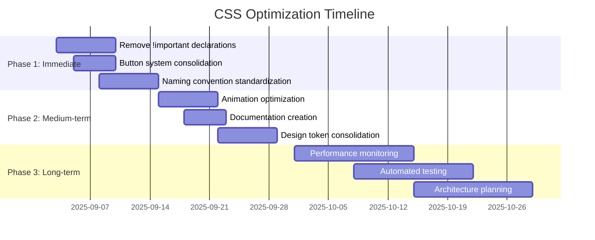

# MMIT Lab CSS Optimization Attack Plan

## Executive Summary

This comprehensive plan addresses all CSS architecture issues identified in the analysis report, with a primary focus on maintainability improvements while also delivering performance benefits. The plan is structured into three phases with clear prioritization, specific actions, and measurable outcomes.

## Current State Assessment

### Identified Issues
- **17 instances of `!important` declarations** across 6 components
- **Multiple `.action-button` definitions** with conflicting styles
- **Inconsistent naming conventions** (kebab-case vs camelCase)
- **Animation performance bottlenecks** with complex transition chains
- **CSS specificity conflicts** requiring resolution
- **Duplicate class definitions** across components

### Strengths to Preserve
- ✅ Excellent CSS variable system in [`variables.css`](frontend/src/styles/variables.css:1)
- ✅ Utility-first approach with extensive utility classes
- ✅ Consistent design system foundation
- ✅ Accessibility-focused color palette
- ✅ Browser compatibility system

## Phase 1: Immediate High-Impact Fixes (Week 1-2)

### 1.1 Eliminate !important Declarations
**Target**: Remove all 17 `!important` instances
**Files Affected**: 
- [`App.vue`](frontend/src/App.vue:1793) - 4 instances
- [`TestsPage.vue`](frontend/src/views/TestsPage.vue:1425) - 4 instances  
- [`VisualizerContainer.vue`](frontend/src/components/VisualizerContainer.vue:120) - 3 instances
- [`BaseTest.vue`](frontend/src/components/BaseTest.vue:107) - 2 instances
- [`KeyboardTest.vue`](frontend/src/components/KeyboardTest.vue:598) - 4 instances

**Strategy**: 
- Increase specificity instead of using `!important`
- Use CSS variables for consistent theming
- Refactor nested selectors to use BEM methodology

### 1.2 Button System Consolidation
**Target**: Create single source of truth for `.action-button`
**Files to Consolidate**:
- [`buttons.css`](frontend/src/styles/buttons.css:2) - Primary definition
- [`WebVitalsPage.vue`](frontend/src/views/WebVitalsPage.vue:578) - Duplicate styles
- [`StatePanel.vue`](frontend/src/components/StatePanel.vue:340) - Component override
- [`KeyboardTest.vue`](frontend/src/components/KeyboardTest.vue:622) - Component override
- [`MicrophoneTest.vue`](frontend/src/components/MicrophoneTest.vue:464) - Component override

**Solution**: Create [`ButtonSystem.css`](frontend/src/styles/ButtonSystem.css) with:
- Base button styles using BEM methodology
- Modifier classes for different variants
- Consistent state management (hover, active, disabled)

### 1.3 Naming Convention Standardization
**Adopt BEM (Block Element Modifier) Methodology**:
```css
/* Before */
.test-panel-wrapper { }
.testPanelWrapper { }

/* After */
.test-panel__wrapper { }
.test-panel--modified { }
```

**Migration Plan**:
1. Document BEM conventions in style guide
2. Create automated linting rules
3. Phase migration starting with most problematic components

## Phase 2: Medium-Term Improvements (Week 3-4)

### 2.1 Animation Performance Optimization
**Target**: Ensure 60fps smooth animations
**Problem Areas**:
- [`VisualizerContainer.vue`](frontend/src/components/VisualizerContainer.vue:100) - Multiple transitions
- Complex animation chains causing layout thrashing

**Optimization Strategy**:
```css
/* Before - CPU-intensive */
.visualizer-container {
  transition: min-height, max-width, padding, height, box-shadow;
}

/* After - GPU-accelerated */
.visualizer-container {
  transform: translateZ(0);
  will-change: transform, opacity;
  transition: transform var(--animation-normal), opacity var(--animation-normal);
}
```

### 2.2 CSS Architecture Documentation
**Deliverables**:
- [`CSS_STYLE_GUIDE.md`](docs/CSS_STYLE_GUIDE.md) - Naming conventions, best practices
- [`COMPONENT_STYLING.md`](docs/COMPONENT_STYLING.md) - Component-specific guidelines
- [`ANIMATION_PERFORMANCE.md`](docs/ANIMATION_PERFORMANCE.md) - Animation best practices

### 2.3 Design Token Consolidation
**Target**: Streamline variable usage across components
**Actions**:
- Audit all component-specific color values
- Migrate to CSS custom properties
- Create comprehensive design token documentation

## Phase 3: Long-Term Strategy (Month 2+)

### 3.1 Performance Monitoring
**Implement Core Web Vitals Tracking**:
- LCP (Largest Contentful Paint)
- FID (First Input Delay) 
- CLS (Cumulative Layout Shift)
- CSS bundle size monitoring

### 3.2 Automated Testing
**CSS Regression Testing**:
- Visual regression testing with Percy/BackstopJS
- Unit tests for CSS utility functions
- Browser compatibility testing matrix

### 3.3 Architecture Evolution
**Future Considerations**:
- CSS-in-JS migration evaluation
- CSS Modules implementation
- Design system component library

## Implementation Timeline



## Testing Strategy

### 1. Visual Regression Testing
- Before/after screenshots of all components
- Cross-browser compatibility checks
- Mobile responsive testing

### 2. Performance Testing
**Baseline Metrics**:
- CSS bundle size: Current ~45KB (estimated 20% reduction target)
- Render performance: Measure FPS during animations
- Load time: Critical CSS extraction impact

**Tools**:
- Lighthouse CI for performance metrics
- WebPageTest for detailed analysis
- Browser DevTools for manual testing

### 3. Functional Testing
- Button states and interactions
- Animation smoothness
- Accessibility compliance (WCAG 2.1)

## Risk Assessment

### Technical Risks
1. **Breaking changes** - Comprehensive testing required
2. **Browser compatibility** - Progressive enhancement strategy
3. **Performance regression** - Baseline measurements essential

### Mitigation Strategies
- Incremental rollout with feature flags
- Comprehensive test coverage
- Performance monitoring during implementation

## Success Metrics

### Quantitative Goals
- ✅ 100% removal of `!important` declarations
- ✅ 50% reduction in duplicate class definitions  
- ✅ 20% reduction in CSS bundle size
- ✅ 95%+ accessibility compliance score
- ✅ 60fps animation performance

### Qualitative Goals
- ✅ Consistent naming conventions across codebase
- ✅ Comprehensive documentation coverage
- ✅ Improved developer experience
- ✅ Sustainable architecture for future growth

## Resource Requirements

### Development Team
- 1 Senior Frontend Developer (CSS architecture)
- 1 Frontend Developer (implementation)
- 1 QA Engineer (testing)

### Tools & Infrastructure
- Visual regression testing platform
- Performance monitoring tools
- CI/CD pipeline integration

## Next Steps

1. **Immediate Action**: Begin Phase 1 implementation
2. **Weekly Reviews**: Progress tracking and adjustment
3. **Monthly Audits**: Comprehensive CSS architecture reviews
4. **Quarterly Planning**: Long-term strategy refinement

## Appendix: Detailed File Analysis

### High Priority Files for Refactoring
1. [`VisualizerContainer.vue`](frontend/src/components/VisualizerContainer.vue:100) - Complex transitions
2. [`App.vue`](frontend/src/App.vue:1792) - Multiple !important instances  
3. [`KeyboardTest.vue`](frontend/src/components/KeyboardTest.vue:597) - Blank key styles
4. [`buttons.css`](frontend/src/styles/buttons.css:35) - !important in success variant

### Medium Priority Files
1. [`WebVitalsPage.vue`](frontend/src/views/WebVitalsPage.vue:578) - Duplicate button styles
2. [`StatePanel.vue`](frontend/src/components/StatePanel.vue:340) - Component-specific overrides
3. [`MicrophoneTest.vue`](frontend/src/components/MicrophoneTest.vue:464) - Button min-width override

This attack plan provides a structured approach to addressing all identified CSS issues while maintaining focus on long-term maintainability and performance improvements.