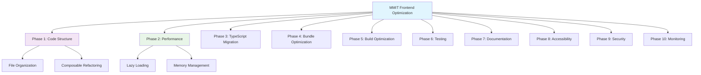

# MMIT Testing Suite - Frontend Optimization Attack Plan

## Executive Summary

This document outlines a comprehensive optimization strategy for the MMIT Testing Suite frontend, a Vue 3 application with extensive device testing capabilities. The current codebase shows solid architecture with composable patterns, but requires systematic optimization across multiple dimensions.

**Current State Assessment:**
- ✅ Strong composable architecture with `useEnhancedDeviceTest` patterns
- ✅ Comprehensive device testing capabilities (webcam, mic, speakers, etc.)
- ✅ Internationalization support with i18n
- ✅ Vite build system with basic optimization
- ⚠️ Mixed JavaScript/TypeScript codebase requiring standardization
- ⚠️ Performance monitoring implemented but could be enhanced
- ⚠️ Bundle size optimization opportunities
- ⚠️ Accessibility and testing coverage gaps

## Optimization Phases Overview

## Phase 1: Code Structure and Organization Improvements

### Priority: High | Effort: Medium | Timeline: 1-2 Weeks

**Current Issues:**
- Mixed file organization patterns
- Duplicate logic between `useDeviceTest` and `useEnhancedDeviceTest`
- Inconsistent component structure

**Action Items:**

1. **File Structure Standardization** ([`frontend/src/`](frontend/src/))
   - Create dedicated directories: `types/`, `utils/`, `constants/`
   - Standardize composable organization pattern
   - Move shared types to [`frontend/src/types/index.ts`](frontend/src/types/index.ts:1)

2. **Composable Architecture Refinement**
   - Consolidate `useDeviceTest` and `useEnhancedDeviceTest` patterns
   - Create base composable with extension system
   - Standardize error handling patterns across all composables

3. **Component Hierarchy Optimization**
   - Audit component inheritance patterns
   - Implement proper component composition
   - Remove duplicate state management logic

**Key Files to Address:**
- [`frontend/src/composables/useDeviceTest.js`](frontend/src/composables/useDeviceTest.js:1) - Legacy pattern
- [`frontend/src/composables/useEnhancedDeviceTest.js`](frontend/src/composables/useEnhancedDeviceTest.js:1) - Enhanced but complex
- [`frontend/src/App.vue`](frontend/src/App.vue:1) - Large component needs splitting

## Phase 2: Performance Optimization Strategies

### Priority: High | Effort: High | Timeline: 2-3 Weeks

**Current Issues:**
- Heavy component initialization
- Memory leaks in media stream handling
- Inefficient re-rendering patterns

**Action Items:**

1. **Lazy Loading Implementation**
   - Dynamic imports for test components
   - Route-based code splitting
   - Composables lazy loading

2. **Memory Management**
   - Proper media stream cleanup ([`useMediaStream.js`](frontend/src/composables/useMediaStream.js))
   - Event listener cleanup automation
   - Component lifecycle optimization

3. **Rendering Performance**
   - Virtual scrolling for device lists
   - Optimized computed properties
   - Debounced event handlers

4. **Real-time Optimization**
   - Web Workers for heavy computations
   - RequestAnimationFrame for animations
   - Throttled state updates

**Performance Targets:**
- First Contentful Paint < 1.5s
- Largest Contentful Paint < 2.5s  
- Time to Interactive < 3.0s
- Memory usage < 100MB sustained

## Phase 3: TypeScript Migration and Type Safety

### Priority: Medium | Effort: High | Timeline: 3-4 Weeks

**Current Issues:**
- Mixed JavaScript/TypeScript codebase
- Incomplete type definitions
- Missing type safety in composables

**Action Items:**

1. **Full TypeScript Migration**
   - Convert all `.js` files to `.ts` ([`tsconfig.json`](frontend/tsconfig.json:1))
   - Comprehensive type definitions
   - Strict mode enforcement

2. **Type System Enhancement**
   - Complete interface definitions in [`types/index.ts`](frontend/src/types/index.ts:1)
   - Generic composable types
   - Event emission typing

3. **Build-time Type Checking**
   - Vue-TSC integration
   - ESLint TypeScript rules
   - Pre-commit type checking

**Key Migration Targets:**
- [`frontend/src/composables/useEnhancedDeviceTest.js`](frontend/src/composables/useEnhancedDeviceTest.js:1) → `.ts`
- [`frontend/src/composables/useDeviceTest.js`](frontend/src/composables/useDeviceTest.js:1) → `.ts`
- [`frontend/src/composables/useCommonTestPatterns.js`](frontend/src/composables/useCommonTestPatterns.js:1) → `.ts`

## Phase 4: Bundle Size Reduction and Tree Shaking

### Priority: High | Effort: Medium | Timeline: 1-2 Weeks

**Current Issues:**
- Large initial bundle size (~2-3MB estimated)
- Duplicate dependencies
- Ineffective tree shaking

**Action Items:**

1. **Bundle Analysis**
   - Run `vite-bundle-analyzer` ([`package.json`](frontend/package.json:16))
   - Identify large dependencies
   - Audit chunk splitting strategy

2. **Dependency Optimization**
   - Audit `package.json` dependencies
   - Remove unused packages
   - Optimize heavy libraries (TensorFlow.js, ML-Matrix)

3. **Tree Shaking Enhancement**
   - Side-effect free package declarations
   - ESM module imports
   - Selective feature imports

4. **Asset Optimization**
   - Image compression pipeline
   - Font subsetting
   - CSS minimization

**Target Metrics:**
- Initial bundle size < 1.5MB
- Chunk size < 500KB
- Gzip compression ratio > 70%

## Phase 5: Build Optimization and Caching

### Priority: Medium | Effort: Low | Timeline: 1 Week

**Current Issues:**
- Basic Vite configuration ([`vite.config.js`](frontend/vite.config.js:1))
- Missing caching strategies
- No CDN optimization

**Action Items:**

1. **Vite Configuration Enhancement**
   - Advanced chunk splitting
   - Preload/prefetch optimization
   - CSS code splitting

2. **Caching Strategy**
   - Content-based hashing
   - Service Worker implementation
   - CDN configuration

3. **Build Pipeline Optimization**
   - Parallel build processes
   - Incremental compilation
   - Build memory optimization

## Phase 6: Testing Improvements

### Priority: Medium | Effort: High | Timeline: 2-3 Weeks

**Current Issues:**
- Limited test coverage
- No E2E testing strategy
- Missing component testing

**Action Items:**

1. **Test Coverage Expansion**
   - Unit tests for composables
   - Component testing with Vue Test Utils
   - E2E testing with Cypress

2. **Testing Infrastructure**
   - Test mocking strategies
   - Device API simulation
   - Performance testing suite

3. **Test Automation**
   - CI/CD integration
   - Performance regression testing
   - Cross-browser testing

**Coverage Targets:**
- Composable tests: 90%+
- Component tests: 80%+
- E2E test critical paths: 100%

## Phase 7: Documentation and Maintainability

### Priority: Low | Effort: Medium | Timeline: 1-2 Weeks

**Current Issues:**
- Incomplete documentation
- Missing architecture diagrams
- No contributor guidelines

**Action Items:**

1. **Technical Documentation**
   - Architecture decision records
   - Composable API documentation
   - Component usage guidelines

2. **Development Tools**
   - Storybook for component development
   - API documentation generator
   - Development environment setup

3. **Maintainability Enhancements**
   - Code quality metrics
   - Technical debt tracking
   - Refactoring roadmap

## Phase 8: Accessibility and UX Enhancements

### Priority: Medium | Effort: Medium | Timeline: 2 Weeks

**Current Issues:**
- Basic accessibility support
- Limited screen reader compatibility
- Keyboard navigation gaps

**Action Items:**

1. **Accessibility Audit**
   - WCAG 2.1 compliance
   - Screen reader testing
   - Keyboard navigation testing

2. **UX Improvements**
   - Loading state optimization
   - Error handling consistency
   - Progressive enhancement

3. **Internationalization Enhancement**
   - Complete i18n coverage
   - RTL language support
   - Localization quality assurance

## Phase 9: Security Best Practices

### Priority: High | Effort: Low | Timeline: 1 Week

**Current Issues:**
- Basic security headers
- No CSP implementation
- Missing security auditing

**Action Items:**

1. **Security Hardening**
   - Content Security Policy
   - Security headers configuration
   - Dependency vulnerability scanning

2. **Privacy Compliance**
   - GDPR/CCPA compliance review
   - Data collection audit
   - Permission request optimization

## Phase 10: Monitoring and Analytics

### Priority: Medium | Effort: Medium | Timeline: 1-2 Weeks

**Current Issues:**
- Basic performance monitoring ([`usePerformance.ts`](frontend/src/composables/usePerformance.ts:1))
- No error tracking
- Missing user analytics

**Action Items:**

1. **Performance Monitoring**
   - Real User Monitoring (RUM)
   - Core Web Vitals tracking
   - Custom performance metrics

2. **Error Tracking**
   - Frontend error aggregation
   - Crash reporting
   - Error analytics

3. **User Analytics**
   - Usage pattern tracking
   - Feature adoption metrics
   - A/B testing infrastructure

## Implementation Roadmap

### Quarter 1 (Weeks 1-4)
- [ ] Phase 1: Code Structure (Weeks 1-2)
- [ ] Phase 4: Bundle Optimization (Weeks 2-3)
- [ ] Phase 9: Security (Week 4)

### Quarter 1 (Weeks 5-8)
- [ ] Phase 2: Performance (Weeks 5-7)
- [ ] Phase 5: Build Optimization (Week 8)

### Quarter 2 (Weeks 9-12)
- [ ] Phase 3: TypeScript Migration (Weeks 9-11)
- [ ] Phase 10: Monitoring (Week 12)

### Quarter 2 (Weeks 13-16)
- [ ] Phase 6: Testing (Weeks 13-15)
- [ ] Phase 8: Accessibility (Week 16)

### Ongoing
- [ ] Phase 7: Documentation (Continuous)

## Risk Assessment

| Risk | Impact | Probability | Mitigation Strategy |
|------|--------|-------------|---------------------|
| TypeScript migration breaks existing code | High | Medium | Incremental migration, comprehensive testing |
| Performance optimizations cause regressions | High | Low | A/B testing, performance monitoring |
| Bundle reduction breaks functionality | Medium | Low | Comprehensive test coverage, gradual optimization |
| Testing infrastructure complexity | Medium | Medium | Start simple, iterate based on needs |

## Success Metrics

- **Performance**: 40% reduction in LCP, 50% reduction in bundle size
- **Quality**: 80%+ test coverage, < 0.1% error rate
- **Maintainability**: 30% reduction in code complexity metrics
- **User Experience**: 95%+ accessibility compliance score

## Resource Requirements

- **Development**: 2-3 senior frontend engineers
- **QA**: 1 dedicated tester for validation
- **DevOps**: Infrastructure support for monitoring/CI/CD
- **Timeline**: 4 months for complete implementation

## Next Steps

1. **Immediate Action**: Begin Phase 1 (Code Structure)
2. **Planning**: Detailed technical specifications for each phase
3. **Execution**: Agile sprints with bi-weekly reviews
4. **Monitoring**: Continuous performance tracking

This optimization plan provides a comprehensive roadmap to transform the MMIT Testing Suite into a high-performance, maintainable, and scalable frontend application.