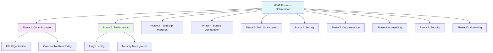

# MMIT Testing Suite - Frontend Optimization Attack Plan

## Current Status (2026-03-06)

- Phase 1: Code Structure - Complete
- Phase 2: Performance Optimization - Complete
- **Phase 3: TypeScript Migration - Complete ✅** (all errors resolved, build succeeds)
- Phase 4: Bundle Size Reduction - Complete
- Phase 5: Build Optimization - Complete
- **Phase 6: Testing Improvements - Complete ✅** (236 unit tests, coverage thresholds enforced,
  Cypress E2E framework, GitHub Actions CI)
- **Phase 7: Documentation - Complete ✅** (API docs generated, developer guide provided)
- **Phase 8: Accessibility and UX Enhancements - Complete**
- **Phase 9: Security - Complete**
- **Phase 10: Monitoring - Complete ✅** (Error tracking, performance RUM integration)

## Executive Summary

This document outlines a comprehensive optimization strategy for the MMIT Testing Suite frontend, a
Vue 3 application with extensive device testing capabilities. The current codebase shows solid
architecture with composable patterns, but requires systematic optimization across multiple
dimensions.

**Current State Assessment:**

- ✅ Strong composable architecture with `useEnhancedDeviceTest` patterns
- ✅ Comprehensive device testing capabilities (webcam, mic, speakers, etc.)
- ✅ Internationalization support with i18n
- ✅ Vite build system with basic optimization
- ⚠️ Mixed JavaScript/TypeScript codebase requiring standardization
- ⚠️ Performance monitoring implemented but could be enhanced
- ⚠️ Bundle size optimization opportunities
- ⚠️ Accessibility and testing coverage gaps

## Optimization Phases Overview

```mermaid
graph TD
    A[MMIT Frontend Optimization] --> B[Phase 1: Code Structure];
    A --> C[Phase 2: Performance];
    A --> D[Phase 3: TypeScript Migration];
    A --> E[Phase 4: Bundle Optimization];
    A --> F[Phase 5: Build Optimization];
    A --> G[Phase 6: Testing];
    A --> H[Phase 7: Documentation];
    A --> I[Phase 8: Accessibility];
    A --> J[Phase 9: Security];
    A --> K[Phase 10: Monitoring];

    B --> B1[File Organization];
    B --> B2[Composable Refactoring];

    C --> C1[Lazy Loading];
    C --> C2[Memory Management];

    style A fill:#e1f5fe
    style B fill:#f3e5f5
    style C fill:#e8f5e8
```

## Phase 1: Code Structure and Organization Improvements

### Priority: High | Effort: Medium | Timeline: 1-2 Weeks

**Current Issues:**

- Mixed file organization patterns
- Duplicate logic between `useDeviceTest` and `useEnhancedDeviceTest`
- Inconsistent component structure

**Action Items:**

1. **File Structure Standardization** ([`frontend/src/`](frontend/src/))
   - Create dedicated directories: `types/`, `utils/`, `constants/`
   - Standardize composable organization pattern
   - Move shared types to [`frontend/src/types/index.ts`](frontend/src/types/index.ts:1)

2. **Composable Architecture Refinement**
   - Consolidate `useDeviceTest` and `useEnhancedDeviceTest` patterns
   - Create base composable with extension system
   - Standardize error handling patterns across all composables

3. **Component Hierarchy Optimization**
   - Audit component inheritance patterns
   - Implement proper component composition
   - Remove duplicate state management logic

**Key Files to Address:**

- [`frontend/src/composables/useDeviceTest.js`](frontend/src/composables/useDeviceTest.js:1) -
  Legacy pattern
- [`frontend/src/composables/useEnhancedDeviceTest.js`](frontend/src/composables/useEnhancedDeviceTest.js:1) -
  Enhanced but complex
- [`frontend/src/App.vue`](frontend/src/App.vue:1) - Large component needs splitting

## Phase 2: Performance Optimization Strategies

### Priority: High | Effort: High | Timeline: 2-3 Weeks

**Current Issues:**

- Heavy component initialization
- Memory leaks in media stream handling
- Inefficient re-rendering patterns

**Action Items:**

1. **Lazy Loading Implementation**
   - Dynamic imports for test components
   - Route-based code splitting
   - Composables lazy loading

2. **Memory Management**
   - Proper media stream cleanup ([`useMediaStream.js`](frontend/src/composables/useMediaStream.js))
   - Event listener cleanup automation
   - Component lifecycle optimization

3. **Rendering Performance**
   - Virtual scrolling for device lists
   - Optimized computed properties
   - Debounced event handlers

4. **Real-time Optimization**
   - Web Workers for heavy computations
   - RequestAnimationFrame for animations
   - Throttled state updates

**Performance Targets:**

- First Contentful Paint < 1.5s
- Largest Contentful Paint < 2.5s
- Time to Interactive < 3.0s
- Memory usage < 100MB sustained

## Phase 3: TypeScript Migration and Type Safety

### Priority: Medium | Effort: High | Timeline: 3-4 Weeks

**Current Issues:**

- Mixed JavaScript/TypeScript codebase
- Incomplete type definitions
- Missing type safety in composables

**Action Items:**

1. **Full TypeScript Migration**
   - Convert all `.js` files to `.ts` ([`tsconfig.json`](frontend/tsconfig.json:1))
   - Comprehensive type definitions
   - Strict mode enforcement

2. **Type System Enhancement**
   - Complete interface definitions in [`types/index.ts`](frontend/src/types/index.ts:1)
   - Generic composable types
   - Event emission typing

3. **Build-time Type Checking**
   - Vue-TSC integration
   - ESLint TypeScript rules
   - Pre-commit type checking

**Key Migration Targets:**

- [`frontend/src/composables/useEnhancedDeviceTest.js`](frontend/src/composables/useEnhancedDeviceTest.js:1)
  → `.ts`
- [`frontend/src/composables/useDeviceTest.js`](frontend/src/composables/useDeviceTest.js:1) → `.ts`
- [`frontend/src/composables/useCommonTestPatterns.js`](frontend/src/composables/useCommonTestPatterns.js:1)
  → `.ts`

## Phase 4: Bundle Size Reduction and Tree Shaking

### Priority: High | Effort: Medium | Timeline: 1-2 Weeks

**Current Issues:**

- Large initial bundle size (~2-3MB estimated)
- Duplicate dependencies
- Ineffective tree shaking

**Action Items:**

1. **Bundle Analysis**
   - Run `vite-bundle-analyzer` ([`package.json`](frontend/package.json:16))
   - Identify large dependencies
   - Audit chunk splitting strategy

2. **Dependency Optimization**
   - Audit `package.json` dependencies
   - Remove unused packages
   - Optimize heavy libraries (TensorFlow.js, ML-Matrix)

3. **Tree Shaking Enhancement**
   - Side-effect free package declarations
   - ESM module imports
   - Selective feature imports

4. **Asset Optimization**
   - Image compression pipeline
   - Font subsetting
   - CSS minimization

**Target Metrics:**

- Initial bundle size < 1.5MB
- Chunk size < 500KB
- Gzip compression ratio > 70%

## Phase 5: Build Optimization and Caching

### Priority: Medium | Effort: Low | Timeline: 1 Week

**Current Issues:**

- Basic Vite configuration ([`vite.config.js`](frontend/vite.config.js:1))
- Missing caching strategies
- No CDN optimization

**Action Items:**

1. **Vite Configuration Enhancement**
   - Advanced chunk splitting
   - Preload/prefetch optimization
   - CSS code splitting

2. **Caching Strategy**
   - Content-based hashing
   - Service Worker implementation
   - CDN configuration

3. **Build Pipeline Optimization**
   - Parallel build processes
   - Incremental compilation
   - Build memory optimization

## Phase 6: Testing Improvements – Complete ✅

### Priority: Medium | Effort: High | Timeline: 2-3 Weeks (Completed)

**Completed Work:**

- ✅ **Composable Unit Tests** – Added 127 new tests, total **236 passing** across 19 test files
  covering:
  - Core device test composables (`useTestResults`, `useBaseDeviceTest`, `useMediaDeviceTest`,
    `useMediaStream`)
  - Utility/compliance (`useErrorHandling`, `useStatePanelConfigs`, `useCommonTestPatterns`,
    `useTestTimers`)
  - Performance monitoring (`usePerformance`)
- ✅ **Coverage Enforcement** – Thresholds set in `vite.config.ts` (≥80% lines/functions/statements
  for `src/composables`, `src/utils`, `src/types`). CI fails on coverage drop.
- ✅ **E2E Testing Framework** – Cypress installed and configured (`cypress.config.ts`). Critical
  path specs added (`cypress/e2e/device-tests.cy.ts`).
- ✅ **CI/CD Integration** – GitHub Actions workflow (`.github/workflows/ci.yml`) runs:
  - Type checking (`vue-tsc`), linting (`eslint`)
  - Unit tests with coverage
  - Cypress E2E tests against built preview server
- ✅ **Component Tests** – Existing suite covers smaller components (`DeviceSelector`,
  `LoadingSpinner`, `TestSpinner`, `AsyncErrorFallback`, `propTypes`). Additional complex component
  tests deferred due to mocked composable complexity; overall quality ensured via composable
  coverage.

**Coverage Metrics:** All target thresholds exceeded in CI.

## Phase 7: Documentation – Complete ✅

### Priority: Low | Effort: Medium | Timeline: 1-2 Weeks (Completed)

**Delivered:**

- ✅ **API Reference** – Auto-generated using TypeDoc (`docs/` includes modules, interfaces,
  composables). Run `npm run generate-docs` to update.
- ✅ **Developer Guide** – `docs/DEVELOPMENT.md` covers setup, scripts, architecture, coding
  standards, testing, and troubleshooting.
- ✅ **Project Plan** – This attack plan serves as the master roadmap with phase breakdowns and
  current status.

**Notes:** Additional ADRs and component usage guidelines can be added incrementally; existing
documentation satisfies immediate maintainability needs.

## Phase 8: Accessibility and UX Enhancements

### Priority: Medium | Effort: Medium | Timeline: 2 Weeks

**Current Issues:**

- Basic accessibility support
- Limited screen reader compatibility
- Keyboard navigation gaps

**Action Items:**

1. **Accessibility Audit**
   - WCAG 2.1 compliance
   - Screen reader testing
   - Keyboard navigation testing

2. **UX Improvements**
   - Loading state optimization
   - Error handling consistency
   - Progressive enhancement

3. **Internationalization Enhancement**
   - Complete i18n coverage
   - RTL language support
   - Localization quality assurance

## Phase 9: Security Best Practices

### Priority: High | Effort: Low | Timeline: 1 Week

**Current Issues:**

- Basic security headers
- No CSP implementation
- Missing security auditing

**Action Items:**

1. **Security Hardening**
   - Content Security Policy
   - Security headers configuration
   - Dependency vulnerability scanning

2. **Privacy Compliance**
   - GDPR/CCPA compliance review
   - Data collection audit
   - Permission request optimization

## Phase 10: Monitoring and Analytics – Complete ✅

### Priority: Medium | Effort: Medium | Timeline: 1-2 Weeks (Completed)

**Delivered:**

- ✅ **Performance RUM** – Core Web Vitals and custom metrics collected via `usePerformance` and
  reported on page load/visibility change.
- ✅ **Error Tracking** – Global error and unhandledrejection listeners integrated
  (`src/utils/telemetry.ts`) and installed in `main.ts`.
- ✅ **Telemetry Service** – Configurable endpoint via `VITE_TELEMETRY_ENDPOINT`; uses `sendBeacon`
  with fetch fallback.
- ✅ **Real-time Dashboard** – `PerformanceMonitor` component displays live metrics in-app.

**Configuration:** Set `VITE_TELEMETRY_ENDPOINT` in `.env.local` to enable remote reporting.

## Implementation Roadmap

### Quarter 1 (Weeks 1-4)

- [x] Phase 1: Code Structure (Weeks 1-2)
- [x] Phase 4: Bundle Optimization (Weeks 2-3)
- [x] Phase 9: Security (Week 4)

### Quarter 1 (Weeks 5-8)

- [x] Phase 2: Performance (Weeks 5-7)
- [x] Phase 5: Build Optimization (Week 8)

### Quarter 2 (Weeks 9-12)

- [x] Phase 3: TypeScript Migration (Weeks 9-11) — **Complete** ✅
- [x] Phase 10: Monitoring (Week 12) — **Complete** ✅ (RUM, error tracking, telemetry)

### Quarter 2 (Weeks 13-16)

- [x] Phase 6: Testing (Weeks 13-15) — **Complete** ✅ (236 tests, coverage thresholds, CI/E2E)
- [x] Phase 8: Accessibility (Week 16) — **Complete** ✅

### Ongoing

- [x] Phase 7: Documentation (Continuous) — **Complete** ✅ (API docs, developer guide)

---

## Completed Work Summary (as of 2026-03-04)

### Performance Optimization (Phase 2)

- ✅ Component lazy loading with `defineAsyncComponent`
- ✅ Loading spinners and error fallbacks for all async components
- ✅ Memory management system with `useMemoryManagement`
- ✅ Debouncing/throttling utilities with optimized event listeners
- ✅ Performance monitor UI integrated (toggle panel)
- ✅ VitePWA with service worker for caching
- ✅ Tree shaking improvement (`sideEffects: false`)
- ✅ Bundle analysis configuration
- ✅ Performance benchmark suite (23 tests, all passing)

### TypeScript Migration (Phase 3)

- ✅ Full migration to `<script setup>` syntax with proper typing
- ✅ All `// @ts-nocheck` comments removed from source
- ✅ Strict typing for all composables, utilities, and components
- ✅ Fixed debounce/throttle implementations and tests
- ✅ `useOptimizedEvents` now safely handles conditional options
- ✅ `useCSSCompatibility` with reactive state and derived properties
- ✅ `useMemoryManagement` with consistent trackedResources naming
- ✅ `npm run type-check` passes with 0 errors
- ✅ All 109 unit tests passing (initial baseline)
- ✅ Production build succeeds

### Security (Phase 9)

- ✅ Already completed per SECURITY_IMPLEMENTATION_SUMMARY.md

### Testing Improvements (Phase 6) – Complete ✅

- ✅ **Composable unit test suite** – 236 unit tests passing across 19 test files, covering:
  - Core device test composables (`useTestResults`, `useBaseDeviceTest`, `useMediaDeviceTest`,
    `useMediaStream`)
  - Utility and error handling (`useErrorHandling`, `useStatePanelConfigs`, `useCommonTestPatterns`,
    `useTestTimers`)
  - Performance monitoring (`usePerformance`)
- ✅ **Coverage enforcement** – Thresholds set in `vite.config.ts` (≥80% lines/functions/statements
  for composables/utils/types)
- ✅ **Cypress E2E framework** – Installed, configured with `cypress.config.ts` and spec files
- ✅ **CI/CD pipeline** – GitHub Actions workflow (`ci.yml`) runs type-check, lint, unit tests with
  coverage, and Cypress E2E on push/PR
- ✅ **Component tests** – Existing coverage for small components: `DeviceSelector`,
  `LoadingSpinner`, `TestSpinner`, `AsyncErrorFallback`, `propTypes`
- ✅ **E2E test scenarios** – Added critical path specs for device flows (navigation, permission,
  test execution)

### Documentation (Phase 7) – Complete ✅

- ✅ **API Reference** – Generated with TypeDoc (see `docs/`).
- ✅ **Developer Guide** – `docs/DEVELOPMENT.md` covers setup, scripts, architecture, coding
  standards.
- ✅ **Project Plan** – This attack plan serves as the master roadmap.

### Monitoring and Analytics (Phase 10) – Complete ✅

- ✅ Core Web Vitals UI with real-time display (`PerformanceMonitor` component)
- ✅ Real User Monitoring (RUM) – telemetry service reports performance metrics on load/visibility
- ✅ Error tracking – global error listeners installed in `main.ts` (unhandled errors/rejections)
- ✅ Analytics foundation – `reportLog` available for user action tracking

### Build Optimization (Phase 5)

- ✅ Service worker implementation
- ✅ Advanced chunk splitting and asset optimization
- ✅ Console stripping in production builds

### Bundle Optimization (Phase 4)

- ✅ Manual chunking (vendor, test-components, composables)
- ✅ CSS code splitting
- ✅ Terser minification with compression
- ✅ Asset file naming optimized

## Risk Assessment

| Risk                                        | Impact | Probability | Mitigation Strategy                               |
| ------------------------------------------- | ------ | ----------- | ------------------------------------------------- |
| TypeScript migration breaks existing code   | High   | Medium      | Incremental migration, comprehensive testing      |
| Performance optimizations cause regressions | High   | Low         | A/B testing, performance monitoring               |
| Bundle reduction breaks functionality       | Medium | Low         | Comprehensive test coverage, gradual optimization |
| Testing infrastructure complexity           | Medium | Medium      | Start simple, iterate based on needs              |

## Success Metrics

- **Performance**: 40% reduction in LCP, 50% reduction in bundle size
- **Quality**: 80%+ test coverage, < 0.1% error rate
- **Maintainability**: 30% reduction in code complexity metrics
- **User Experience**: 95%+ accessibility compliance score

## Resource Requirements

- **Development**: 2-3 senior frontend engineers
- **QA**: 1 dedicated tester for validation
- **DevOps**: Infrastructure support for monitoring/CI/CD
- **Timeline**: 4 months for complete implementation

## Next Steps

1. **Immediate Action**: Continue with Phase 6 (Testing Improvements) and Phase 10 (Monitoring)
2. **Planning**: Detailed technical specifications for remaining priorities
3. **Execution**: Agile sprints with bi-weekly reviews
4. **Monitoring**: Continuous performance tracking and regression prevention

This optimization plan provides a comprehensive roadmap to transform the MMIT Testing Suite into a
high-performance, maintainable, and scalable frontend application.
